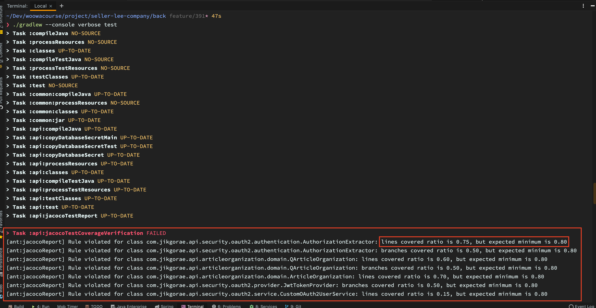
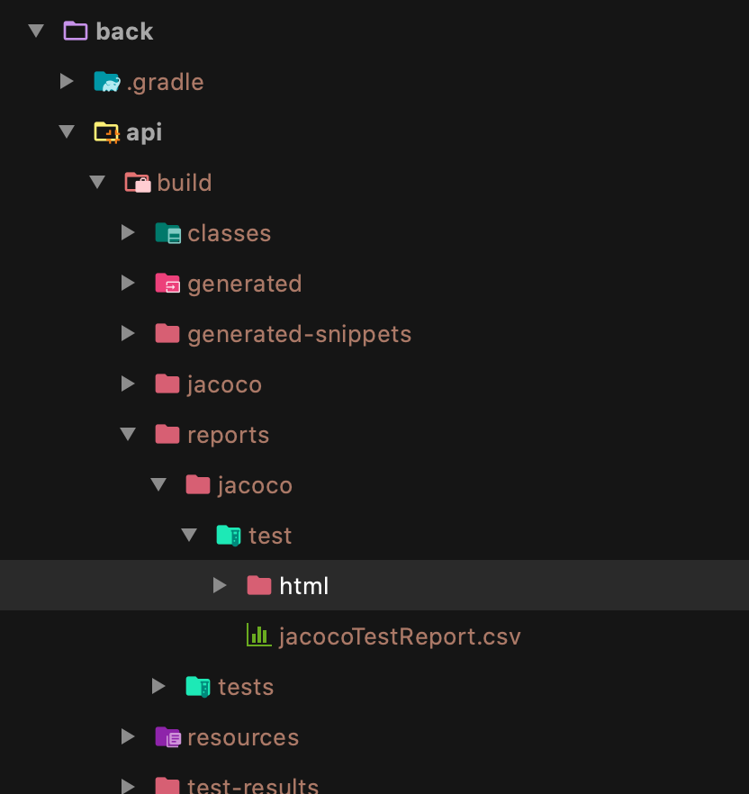
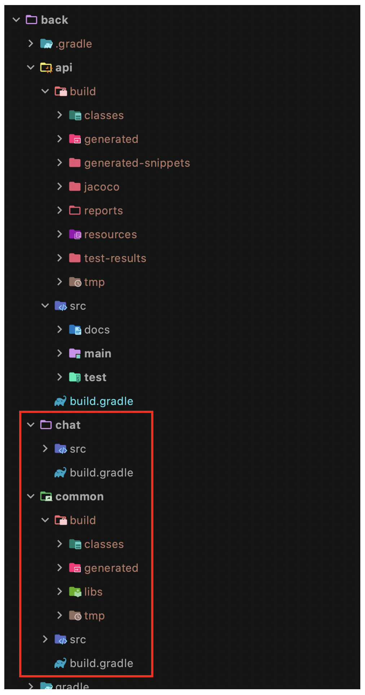
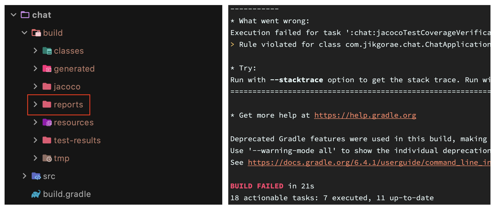

안녕하세요. 우아한테크코스 2기, 셀러리 컴퍼니에서 [직고래](https://sites.google.com/woowahan.com/wooteco-demo/%EC%A7%81%EA%B3%A0%EB%9E%98)를 개발하고 있는 스티치입니다.


[코드 분석 도구 적용기 - 1편, 코드 커버리지(Code Coverage)가 뭔가요?](https://seller-lee.github.io/java-code-coverage-tool-part1)에 이어서, 이번에는 프로젝트에 **코드 커버리지 분석 도구인 JaCoCo를 어떻게 적용했는지**에 대해 소개해드리도록 하겠습니다.

---

## [JaCoCo](https://www.jacoco.org/jacoco/)란?

### JaCoCo

> JaCoCo is a free code coverage library for Java, which has been created by the EclEmma team based on the lessons learned from using and integration existing libraries for many years. - [JaCoCo](https://www.jacoco.org/jacoco/)

**JaCoCo**는 **자바 코드 커버리지를 체크하는 데에 사용되는 오픈소스 라이브러리**입니다.

> JaCoCo의 버전은 [Maven Central Repository](https://search.maven.org/search?q=g:org.jacoco)를 통해 확인할 수 있습니다. 작성일(20.10.05) 기준, 최신 버전은 **0.8.6**입니다.

### JaCoCo의 특징

JaCoCo가 가지는 **특징**으로는

- **Line, Branch Coverage를 제공**한다.
- **코드 커버리지 결과**를 보기 좋도록 **파일 형태로 저장**할 수 있다.
  - html, xml, csv 등으로 Report를 생성할 수 있다.
- 설정한 **커버리지 기준을 만족하는지 확인**할 수 있다.

등이 있습니다.

이러한 특징들은 **코드 커버리지를 쉽게 확인하고 관리할 수 있도록 도와줍니다.**

---

## 프로젝트에 JaCoCo 적용하기

### 개발 환경

- Java 8
- Spring Boot 2.3.1
- Gradle 6.4.1

현재 직고래 프로젝트의 개발 환경은 위와 같습니다.


저희 프로젝트 구조의 경우 **api, chat, common,** 총 3개의 모듈로 구성된 **멀티 모듈 프로젝트**입니다. 

JaCoCo를 싱글 모듈 프로젝트에 적용하는 방법과 멀티 모듈 프로젝트에 적용하는 방법은 조금 차이가 있습니다. 아쉽지만 이번 글에서는 저희 프로젝트의 구조인 **멀티 모듈 프로젝트**에 적용하는 방법을 보여드리겠습니다.

> 일반적인 싱글 모듈 프로젝트에 적용하는 방법은 우아한형제들 기술 블로그에 연철님께서 쓰신 [Gradle 프로젝트에 JaCoCo 설정하기](https://woowabros.github.io/experience/2020/02/02/jacoco-config-on-gradle-project.html) 글을 참고하시면 될 것 같습니다.

### JaCoCo 플러그인 추가

저희 루트 프로젝트의 `build.gradle` 파일은 아래와 같습니다.

```java
plugins {
    id 'java'
    id 'org.springframework.boot' version '2.3.1.RELEASE'
    id 'io.spring.dependency-management' version '1.0.9.RELEASE'
    id "org.asciidoctor.convert" version "1.5.9.2"
}

allprojects {
    group = 'com.jikgorae'
    version = '0.0.1-SNAPSHOT'
}

subprojects {
    apply plugin: 'java'
    apply plugin: 'org.springframework.boot'
    apply plugin: 'io.spring.dependency-management'
    apply plugin: 'org.asciidoctor.convert'

    sourceCompatibility = '1.8'

    repositories {
        mavenCentral()
    }
}

project(':api') {
    dependencies {
        compile project(':common')
    }
}

project(':chat') {
    dependencies {
        compile project(':common')
    }
}
```

저희는 모든 모듈의 테스트에 JaCoCo를 적용하고 싶기 때문에 **JaCoCo 플러그인**을 `subprojects` 블록에 설정값으로 추가해야 합니다.

`apply plugin`의 값으로 `'jacoco'`를 추가하면 됩니다.

```java
...

subprojects {
    apply plugin: 'java'
    apply plugin: 'org.springframework.boot'
    apply plugin: 'io.spring.dependency-management'
    apply plugin: 'org.asciidoctor.convert'
    apply plugin: 'jacoco' // 추가

    sourceCompatibility = '1.8'

    repositories {
        mavenCentral()
    }
}

...
```

위 설정을 추가한 후, gradle 새로 고침을 실행하면 의존성이 추가되면서 서브 모듈의 `Tasks/verification`에 JaCoCo의 Task가 추가됩니다.


추가된 `jacocoTestReport`와 `jacocoTestCoverageVerification`은 **JaCoCo 플러그인**의 Task입니다. 각 Task의 역할을 간단하게 살펴보면

- `jacocoTestReport` : 바이너리 커버리지 결과를 사람이 **읽기 좋은 형태의 리포트로 저장**해주는 Task이다.
- `jacocoTestCoverageVerification` : **원하는 커버리지 기준을 만족하는지 확인**해 주는 Task이다.

정도로 볼 수 있습니다. 추가적인 내용은 각 Task에 대한 설정을 진행하면서 소개하도록 하겠습니다.

### JaCoCo 플러그인 설정하기

위의 두 가지 Task에 대한 설정을 진행하기 전에, [JaCoCo 플러그인 설정](https://docs.gradle.org/current/dsl/org.gradle.testing.jacoco.plugins.JacocoPluginExtension.html)을 먼저 해주어야 합니다.

`jacoco`라는 이름을 가지는 `JaCoCoPluginExtension` 타입의 **project extension**을 통해 추가적인 설정을 해줄 수 있으며, 설정해줄 수 있는 속성으로는 `reportsDir`과 `toolVersion`이 있습니다.

- `reportsDir` : 사용할 JaCoCo의 JAR 버전
- `toolVersion` : Report가 생성될 디렉토리 경로

저희는 여기서 `toolVersion`만 설정하고 넘어가도록 하겠습니다. `toolVersion`은 작성일(20.10.05)을 기준으로 가장 최신 버전인 **0.8.6**로 설정하겠습니다.

> `reportsDir`을 설정하지 않을 경우, `${project.reporting.baseDir}/jacoco` 가 기본 경로입니다.

```java
...

subprojects {
    apply plugin: 'java'
    apply plugin: 'org.springframework.boot'
    apply plugin: 'io.spring.dependency-management'
    apply plugin: 'org.asciidoctor.convert'
    apply plugin: 'jacoco'

    sourceCompatibility = '1.8'

    repositories {
        mavenCentral()
    }

    jacoco {
        toolVersion = '0.8.6' // 작성일(20.10.05) 기준
        // reportsDir = ${project.reporting.baseDir}/jacoco
    }
}

...
```

### `jacocoTestReports` Task 설정하기

이번에는 테스트 결과를 리포트 파일로 저장하는 `jacocoTestReports` Task의 [설정](https://docs.gradle.org/current/dsl/org.gradle.testing.jacoco.tasks.JacocoReport.html#org.gradle.testing.jacoco.tasks.JacocoReport:reports)을 해야 합니다.

`jacocoTestReports` Task는 테스트 결과를 html, csv, xml 형태로 저장해줍니다. html의 경우 **사용자가 읽기 편한 파일 형식**이고, csv나 xml의 경우 추후 연동할 **소나큐브(*SonarQube*) 등에서 사용되는 파일 형식**입니다.

**테스트 결과를 받을 파일 형식**은 `jacocoTestReport`의 `reports` 메서드를 통해 설정해 줄 수 있습니다.

```java
reports {
    html {
        enabled false
    }
    csv {
        enabled true
    }
}
```

추가적으로 **파일 형식에 따라 저장하는 경로를 다르게** 할 수 있는 방법도 있는데 설정 방법은 아래와 같습니다.

```java
reports {
    html {
        enable true
        destination file('build/reports/myReport.html')
    }
}
```

> `destination`은 `File` 타입의 값만 받기 때문에 `file('저장할 디렉토리 경로')`과 같은 형식으로 작성해야 합니다. 

```java
reports {
    html.enabled false
    html.destination file('build/reports/myReport.html')
    csv.enabled true
}
```

또는 위의 예제와 같이 좀 더 간단한 방법으로도 설정이 가능합니다.

저희 프로젝트에서는 팀원이 테스트 결과를 보기 쉽고 추후 소나큐브에서 사용할 수 있게 **html과 csv**, 두 가지 파일 형식을 설정하도록 하겠습니다.

```java
subprojects {
    apply plugin: 'java'
    apply plugin: 'org.springframework.boot'
    apply plugin: 'io.spring.dependency-management'
    apply plugin: 'org.asciidoctor.convert'
    apply plugin: 'jacoco'

    sourceCompatibility = '1.8'

    repositories {
        mavenCentral()
    }

    jacoco {
        toolVersion = '0.8.6'
    }

    jacocoTestReport {
        reports {
            html.enabled true // html 설정
            csv.enabled true // csv 설정
            xml.enabled false // xml 미설정
        }
    }
}
```

### `jacocoTestCoverageVerification` Task 설정하기

이번에는 **원하는 코드 커버리지를 설정하고, 커버리지를 만족하는지 여부를 확인**할 수 있는 `jacocoTestCoverageVerification` Task의 [설정](https://docs.gradle.org/current/dsl/org.gradle.testing.jacoco.tasks.JacocoCoverageVerification.html)을 살펴보겠습니다.

`jacocoTestCoverageVerification` Task는 **최소 코드 커버리지 수준을 설정**할 수 있고, 이를 통과하지 못할 경우 Task가 **실패**하게 됩니다.

`jacocoTestCoverageVerification`의 `violationRules` 메서드를 통해 **커버리지 기준을 설정하는 룰을 정의**할 수 있고, 각각의 룰에 대한 설정은 `violationRules` 메서드에 전달할 `rule` 메서드를 통해 정의할 수 있습니다.

depth가 깊다 보니 설명만으로는 이해하기 힘든 것 같습니다. 실제 코드를 통해 `rule` 메서드에 적용할 수 있는 값들이 어떤 것이 있는지 알아보도록 하겠습니다.

```java
jacocoTestCoverageVerification {
    violationRules {
        rule {
            enable = true
            element = 'CLASS'
            // includes = []

            limit {
                counter = 'BRANCH'
                value = 'COVEREDRATIO'
                minimum = 0.90
            }

            limit {
                counter = 'LINE'
                value = 'COVEREDRATIO'
                minimum = 0.80
            }

            limit {
                counter = 'LINE'
                value = 'TOTALCOUNT'
                maximum = 200
            }

            // excludes = []
        }
        
        // 여러 rule을 생성할 수 있습니다.
        rule {
            ... 
        }
    }
}
```

#### `enable`

해당하는 rule의 **활성화 여부**를 boolean으로 나타냅니다. 값을 지정하지 않는 경우 Default 값은 **true**입니다.

#### [`element`](https://www.eclemma.org/jacoco/trunk/doc/api/org/jacoco/core/analysis/ICoverageNode.ElementType.html)

**커버리지를 체크할 기준(단위)**을 정할 수 있으며, 총 6개의 기준이 존재합니다.

- BUNDLE : 패키지 번들(프로젝트 모든 파일을 합친 것)
- CLASS : 클래스
- GROUP : 논리적 번들 그룹
- METHOD : 메서드
- PACKAGE : 패키지
- SOURCEFILE : 소스 파일

값을 지정하지 않는 경우 Default 값은 **`BUNDLE`**입니다.

#### `includes`

해당하는 `rule`을 **적용 대상**을 package 수준으로 정의할 수 있습니다. 값을 지정하지 않는 경우 Default 값은 **전체 package** 입니다.

#### [`counter`](https://www.eclemma.org/jacoco/trunk/doc/api/org/jacoco/core/analysis/ICoverageNode.CounterEntity.html)

`counter`는 `limit` 메서드를 통해 지정할 수 있으며 **커버리지 측정의 최소 단위**를 말합니다. 이때 측정은 java byte code가 실행된 것을 기준으로 측정되고, 총 6개의 단위가 존재합니다.

- BRANCH : 조건문 등의 분기 수
- CLASS : 클래스 수, 내부 메서드가 한 번이라도 실행된다면 실행된 것으로 간주한다.
- COMPLEXITY : [복잡도](https://www.eclemma.org/jacoco/trunk/doc/counters.html)
- INSTRUCTION : Java 바이트코드 명령 수
- METHOD : 메서드 수, 메서드가 한 번이라도 실행된다면 실행된 것으로 간주한다.
- LINE : 빈 줄을 제외한 실제 코드의 라인 수, 라인이 한 번이라도 실행되면 실행된 것으로 간주한다.

값을 지정하지 않는 경우 Default 값은 **`INSTRUCTION`**입니다.

#### [`value`](https://www.eclemma.org/jacoco/trunk/doc/api/org/jacoco/core/analysis/ICounter.CounterValue.html)

`value`는 `limit` 메서드를 통해 지정할 수 있으며 **측정한 커버리지를 어떠한 방식으로 보여줄 것**인지를 말합니다. 총 5개의 방식이 존재합니다.

- COVEREDCOUNT : 커버된 개수
- COVEREDRATIO : 커버된 비율, 0부터 1사이의 숫자로 1이 100%이다.
- MISSEDCOUNT : 커버되지 않은 개수
- MISSEDRATIO : 커버되지 않은 비율, 0부터 1사이의 숫자로 1이 100%이다.
- TOTALCOUNT : 전체 개수

값을 지정하지 않은 경우 Default 값은 **`COVEREDRATIO`**입니다.

#### `minimum`

`minimum`은 `limit` 메서드를 통해 지정할 수 있으며 `counter` 값을 `value`에 맞게 표현했을 때 **최솟값**을 말합니다. 이 값을 통해 `jacocoTestCoverageVerification`의 **성공 여부가 결정**됩니다.

해당 값은 `BigDecimal` 타입이고 **표기한 자릿수만큼 `value`가 출력**됩니다. 만약 커버리지를 80%를 원했는데 0.80이 아니라 0.8을 입력하면 커버리지가 0.87이라도 0.8로 표시됩니다.

`minimum`은 Default 값이 존재하지 않습니다.

#### `excludes`

커버리지를 측정할 때 **제외할 클래스**를 지정할 수 있습니다. 패키지 레벨의 경로로 지정하여야 하고 경로에는 `*`와 `?`를 사용할 수 있습니다.

지금까지 `rule` 메서드에 적용할 수 있는 **설정값**들에 대해 알아보았습니다. 학습한 내용을 바탕으로 저희 프로젝트의 `jacocoTestCoverageVerification` Task를 설정해보겠습니다.

```java
subprojects {
    apply plugin: 'java'
    apply plugin: 'org.springframework.boot'
    apply plugin: 'io.spring.dependency-management'
    apply plugin: 'org.asciidoctor.convert'
    apply plugin: 'jacoco'

    sourceCompatibility = '1.8'

    repositories {
        mavenCentral()
    }

    jacoco {
        toolVersion = '0.8.6'
    }

    jacocoTestReport {
        reports {
            html.enabled true
            csv.enabled true
            xml.enabled false
        }
    }

    jacocoTestCoverageVerification {
        violationRules {
            rule {
                enabled = true // 활성화
                element = 'CLASS' // 클래스 단위로 커버리지 체크
                // includes = []                

                // 라인 커버리지 제한을 80%로 설정
                limit {
                    counter = 'LINE'
                    value = 'COVEREDRATIO'
                    minimum = 0.80
                }

                // 브랜치 커버리지 제한을 80%로 설정
                limit {
                    counter = 'BRANCH'
                    value = 'COVEREDRATIO'
                    minimum = 0.80
                }

                excludes = []
            }
        }
    }
}
```

### `test` Task 설정하기

JaCoCo 플러그인은 모든 test 타입의 Task에 `JacocoTaskExtension`을 추가하고, **`test` Task에서 그 설정을 변경**할 수 있게 합니다.

`test` Task에 Default로 설정된 값은 아래와 같습니다.

```java
test {
    jacoco {
        enabled = true
        destinationFile = file("$buildDir/jacoco/${name}.exec")
        includes = []
        excludes = []
        excludeClassLoaders = []
        includeNoLocationClasses = false
        sessionId = "<auto-generated value>"
        dumpOnExit = true
        classDumpDir = null
        output = JacocoTaskExtension.Output.FILE
        address = "localhost"
        port = 6300
        jmx = false
    }
}
```

각 설정값은 오버라이드가 가능합니다. 저희 프로젝트에는 기본값에서 변경할 내용이 없기 때문에 넘어가도록 하겠습니다.

### JaCoCo 플러그인 Task 순서 설정하기

이제 마지막 관문에 도착했습니다! 지금까지 살펴본 JaCoCo 플러그인의 Task들에 **의존성을 설정**해야 하는데 어떻게 해야하는지 알아보겠습니다.


JaCoCo 플러그인의 [User Guide 문서](https://docs.gradle.org/current/userguide/jacoco_plugin.html#sec:jacoco_getting_started)를 보면 `jacocoTestReport` Task로 리포트를 생성하기 **이전에** `test` Task가 실행되어야 하는데, `jacocoTestReport` Task에는 `test` Task와의 **의존성이 설정되어있지 않다**고 합니다.

위의 의존성 설정은 `test` Task의 설정에 **한 줄만 추가**하면 해결할 수 있습니다. 이 설정만 추가하면 끝인..줄 알았지만 아직 한 가지 설정이 더 남았습니다.

바로 **`jacocoTestReport` Task와 `jacocoTestCoverageVerification` Task 간의 순서**입니다. 

앞서 `jacocoTestReport`는 **리포트를 생성하는 Task**, `jacocoTestCoverageVerification`는 **설정한 커버리지를 만족하는지 확인하는 Task**라고 설명했습니다. 만약, 이 둘의 순서를 지정하지 않아서 `jacocoTestCoverageVerification` Task가 `jacocoTestReport` Task보다 **먼저 실행되면** 어떤 일이 발생할까요?

사실 엄청나게 큰일이 나는 것은 아닙니다 🤣

단지 `jacocoTestCoverageVerification` Task가 먼저 실행되고 설정한 커버리지를 통과하지 못하면 **gradle 빌드가 멈추게 됩니다.** 그렇다면 `jacocoTestReport` Task는 실행되지 않게 되고, **리포트가 생성되지 않으면서 저희는 이전 테스트에서 생성된 리포트를 보는 경우가 발생**할 수 있기 때문입니다.

그렇다면 저희는 **`test` -> `jacocoTestReport` -> `jacocoTestCoverageVerification` 순서로 Task를 실행**하면 위의 모든 조건을 만족할 수 있습니다. 이 순서는 `finalizedBy` 라는 메서드를 사용하여 설정할 수 있습니다.

저희 프로젝트의 Task를 위 순서대로 설정해보도록 하겠습니다.

```java
subprojects {
    apply plugin: 'java'
    apply plugin: 'org.springframework.boot'
    apply plugin: 'io.spring.dependency-management'
    apply plugin: 'org.asciidoctor.convert'
    apply plugin: 'jacoco'

    sourceCompatibility = '1.8'

    repositories {
        mavenCentral()
    }

    test {
        useJUnitPlatform() // JUnit5를 사용하기 위한 설정
        finalizedBy 'jacocoTestReport' // 추가
    }

    jacoco {
        toolVersion = '0.8.6'
    }

    jacocoTestReport {
        reports {
            html.enabled true
            csv.enabled true
            xml.enabled false
        }
        finalizedBy 'jacocoTestCoverageVerification' // 추가
    }

    jacocoTestCoverageVerification {
        violationRules {
            rule {
                enabled = true
                element = 'CLASS'

                limit {
                    counter = 'LINE'
                    value = 'COVEREDRATIO'
                    minimum = 0.80
                }

                limit {
                    counter = 'BRANCH'
                    value = 'COVEREDRATIO'
                    minimum = 0.80
                }

                excludes = []
            }
        }
    }
}
```

### 테스트 실행하기

드디어, 긴 설정을 마무리하고 JaCoCo 테스트를 돌려볼 시간입니다.

`./gradlew test` 명령을 사용해서 `test` Task를 실행해보도록 하겠습니다.

> 명령어에 `--console verbose` 옵션을 추가하면 실행되는 Task를 함께 볼 수 있습니다.



실행한 결과 `jacocoTestCoverageVerification` Task가 실패하였습니다. 결과를 살펴보면 **설정한 커버리지를 만족하지 못한 클래스와 해당 클래스의 커버리지 결과를 함께 보여줍니다.**

실행 결과에 표시해둔 빨간 네모 속 네모를 보면 `AuthorizationExtractor` 클래스의 라인 커버리지가 0.75이고 제가 설정한 커버리지는 0.80이기 때문에 통과하지 못한 것을 볼 수 있습니다.

이렇게 커버리지를 통과하지 못한 클래스가 존재하면 **gradle 빌드는 실패**하게 됩니다.


빌드는 실패했지만 앞서 Task의 순서를 설정해두었기 때문에 리포트는 정상적으로 생성되었을 것입니다.



리포트는 생성되는 위치를 설정하지 않았기 때문에 Default 경로인 `build/reports/jacoco/test/html/index.html`에 저장되었습니다.


만들어진 html 리포트는 각 커버리지 항목마다 **총 개수와 놓친 개수**를 표시해줍니다. 저희 프로젝트에서는 라인 커버리지와 브랜치 커버리지를 모두 확인하기 때문에 각각의 커버리지 정보도 함께 표시되어 있습니다.

리포트에서 클래스의 메서드를 클릭하면 해당 메서드에서 커버된 라인들을 확인할 수도 있습니다.


### 커버리지에 제외할 클래스 설정하기


api 서브 모듈에 `evaluation.domain` 패키지의 커버리지를 보면 `QEvaluation` 클래스와 `QScore` 클래스가 **전혀 커버되지 않음**을 볼 수 있습니다.

저희 프로젝트의 api 서브 모듈에서는 **QueryDSL**을 사용하고 있습니다. 위 예시의 `QEvaluation` 클래스와 `QScore` 클래스는 QueryDSL가 자동으로 생성한 **Qdomain 클래스**입니다.

해당 클래스는 커버리지에서 확인할 필요가 없기 때문에 저희 프로젝트에서 Qdomain 클래스를 **커버리지 측정 대상에서 제외하는 설정**을 추가해보겠습니다.

> 지금 소개할 QueryDSL의 **Qdomain 클래스를 커버리지 측정 대상에서 제외하는 설정**은 우테코 크루인 [비밥의 블로그](https://bottom-to-top.tistory.com/36)의 내용을 참고했습니다.

#### 커버리지 측정에서 제외하는 설정

먼저 제외할 Qdomain 클래스 명을 **리스트로 만드는 방법**에 대해 알아보겠습니다.

> 해당 리스트는 `jacocoTestCoverageVerification` Task에 `excludes` 속성의 값으로 사용됩니다.
>
> 이때 사용할 값은 `*`와 `?`를 통해 패턴처럼 설정할 수 있습니다.  

**Qdomain 클래스 명**의 **Prefix는 Q**입니다. 이를 보고 단순하게 `'*.Q*'`를 `excludes` 값을 지정하면 **예상치 못한 문제**가 발생하게 됩니다.

바로 **Q로 시작하는 domain 클래스**들, 예를 들어 Question, Quality, Quantity 같은 domain 클래스도 **함께 제외**된다는 것입니다.

우테코 크루인 [비밥의 블로그](https://bottom-to-top.tistory.com/36)에서는 이를 **Qdomain 클래스 명의 특징**을 통해 센스있게 해결하였는데, 저희도 이 방법을 사용하도록 하겠습니다.

Qdomain의 경우 기존의 domain 클래스 명에 Prefix로 Q가 붙는다고 하였습니다. 기존의 domain 클래스 명도 **첫문자는 대문자**이기 때문에 QScore와 같은 Qdomain 클래스 명을 가지게 됩니다. 즉 **Q + 알파벳 대문자**의 형식으로 Qdomain 클래스 명을 가지게 됩니다.

그래서 **`'*.QA*'`부터 `'*.QZ*'`까지** 모두 `excludes` 값으로 지정하면 앞서 설명한 Side-effect를 방지할 수 있습니다.

또한 Gradle의 Groovy 문법은 이 방법을 생각보다 쉽게 구현할 수 있습니다.

```java
def Qdomains = []

for (qPattern in '*.QA'..'*.QZ') { // qPattern = '*.QA', '*.QB', ... '*.QZ'
    Qdomains.add(qPattern + '*')
}
```

위의 코드는 결론적으로 **`'*.QA*'`부터 `'*.QZ*'`까지의 모든 값**을 만들어서 **`Qdomains` 리스트에 저장**합니다(이 코드는 아래의 **리포트를 작성할 때 제외하는 설정**에서도 조금만 변경해서 사용합니다).

그럼 이제 `jacocoTestCoverageVerification` Task에 `excludes` 값으로 지정하면 됩니다.

```java
subprojects {
    apply plugin: 'java'
    apply plugin: 'org.springframework.boot'
    apply plugin: 'io.spring.dependency-management'
    apply plugin: 'org.asciidoctor.convert'
    apply plugin: 'jacoco'

    sourceCompatibility = '1.8'

    repositories {
        mavenCentral()
    }

    test {
        useJUnitPlatform()
        finalizedBy 'jacocoTestReport'
    }

    jacoco {
        toolVersion = '0.8.6'
    }

    jacocoTestReport {
        reports {
            html.enabled true
            csv.enabled true
            xml.enabled false
        }
        finalizedBy 'jacocoTestCoverageVerification'
    }

    jacocoTestCoverageVerification {
        def Qdomains = []

        for (qPattern in '*.QA'..'*.QZ') { // qPattern = '*.QA', '*.QB', ... '*.QZ'
            Qdomains.add(qPattern + '*')
        }

        violationRules {
            rule {
                enabled = true
                element = 'CLASS'

                limit {
                    counter = 'LINE'
                    value = 'COVEREDRATIO'
                    minimum = 0.80
                }

                limit {
                    counter = 'BRANCH'
                    value = 'COVEREDRATIO'
                    minimum = 0.80
                }

                excludes = [] + Qdomains // 제외할 Qdomains 패턴 추가
            }
        }
    }
}
```

#### 리포트를 작성할 때 제외하는 설정

**리포트를 작성할 때 제외**하기 위해서는 리포트를 작성해주는 `jacocoTestReport` Task에 설정을 추가하여야 합니다.

아래 설정에 대한 코드를 보면서 설명해드리도록 하겠습니다.

> `Qdomains` 리스트를 생성하는 로직은 `'*.QA'..'*.QZ'`을 `'**/QA'..'**/QZ'`로만 변경하면 됩니다.

```java
jacocoTestReport {
    reports {
        html.enabled true
        csv.enabled true
        xml.enabled false
    }

    def Qdomains = []

    for (qPattern in '**/QA'..'**/QZ') { // qPattern = '*.QA', '*.QB', ... '*.QZ'
        Qdomains.add(qPattern + '*')
    }

    // 여기부터
    afterEvaluate {
        classDirectories.setFrom(
                files(classDirectories.files.collect {
                    fileTree(dir: it, excludes: [] + Qdomains)
                })
        )
    }

    finalizedBy 'jacocoTestCoverageVerification'
}
```

> 이 부분은 제가 정확히 이해하지 못한 부분이 많이 있습니다. 틀린 부분이 보이면 언제든지 지적해주시면 감사하겠습니다 🙇🏻‍♂️

[`afterEvaluate`](https://docs.gradle.org/current/userguide/build_lifecycle.html#sec:project_evaluation)는 gradle의 빌드 라이프 사이클에 대한 메서드입니다. 프로젝트가 평가된 후 실행할 수 있도록 도와줍니다.

[`classDirectories`](https://docs.gradle.org/current/dsl/org.gradle.testing.jacoco.tasks.JacocoReport.html#org.gradle.testing.jacoco.tasks.JacocoReport:classDirectories)는 **커버리지가 리포트로 작성할 소스 파일**을 말합니다. 여기서는 `setFrom` 메서드를 통해 이를 설정해줍니다.

[`files`](https://docs.gradle.org/current/javadoc/org/gradle/api/Project.html#files-java.lang.Object...-)는 지정된 파일을 포함하는 `ConfigurableFileCollection` 타입을 반환합니다.

`files` 내부 코드는 정확하지는 않지만, 기존의 `classDirectories`의 파일들을 돌면서 각 파일을 통해 계층 구조로 된 파일 컬렉션인 `fileTree`을 생성합니다. 그리고 `excludes`로 **Qdomains 리스트를 지정**합니다.

위 과정을 거치면 저희가 받는 리포트에는 **Qdomain 클래스가 모두 제외**되게 됩니다. 그럼 `./gradlew test`를 실행 시켜 결과를 확인해보도록 하겠습니다.

먼저 위의 설정을 적용하기 전은 


위의 설정을 적용한 결과는


와 같습니다.

실행 결과를 살펴보면 기존에 존재한 `QArticleOrganization` 클래스가 `test` Task를 실행한 결과와 리포트 결과에서 **제외되었음**을 알 수 있습니다.

#### 참고. `@Generated`로 생성된 코드 제외하기

현재 저희 프로젝트에서는 [lombok](https://projectlombok.org/)을 사용하고 있지 않습니다. 그러나 lombok을 사용하는 프로젝트의 경우에는 generated code를 커버리지에서 제외하고 싶을 수 있습니다.

이를 해결하는 방법은 매우 간단합니다.

프로젝트의 루트에서 `lombok.config` 파일을 생성하고 `lombok.addLombokGeneratedAnnotation = true` 코드를 한 줄을 추가해주면 끝!

### 최종 설정 확인하기

드디어 기나긴 여정이 끝났습니다! 지금까지의 모든 설정을 적용한 gradle.build 파일은 아래와 같습니다.

```java
...

subprojects {
    apply plugin: 'java'
    apply plugin: 'org.springframework.boot'
    apply plugin: 'io.spring.dependency-management'
    apply plugin: 'org.asciidoctor.convert'
    apply plugin: 'jacoco'

    sourceCompatibility = '1.8'

    repositories {
        mavenCentral()
    }

    test {
        useJUnitPlatform()
        finalizedBy 'jacocoTestReport'
    }

    jacoco {
        toolVersion = '0.8.6'
    }

    jacocoTestReport {
        reports {
            html.enabled true
            csv.enabled true
            xml.enabled false
        }

        def Qdomains = []

        for (qPattern in '**/QA'..'**/QZ') { // qPattern = '*.QA', '*.QB', ... '*.QZ'
            Qdomains.add(qPattern + '*')
        }

        afterEvaluate {
            classDirectories.setFrom(
                    files(classDirectories.files.collect {
                        fileTree(dir: it, excludes: [] + Qdomains)
                    })
            )
        }

        finalizedBy 'jacocoTestCoverageVerification'
    }

    jacocoTestCoverageVerification {
        def Qdomains = []

        for (qPattern in '*.QA'..'*.QZ') { // qPattern = '*.QA', '*.QB', ... '*.QZ'
            Qdomains.add(qPattern + '*')
        }

        violationRules {
            rule {
                enabled = true
                element = 'CLASS'

                limit {
                    counter = 'LINE'
                    value = 'COVEREDRATIO'
                    minimum = 0.00
                }

                limit {
                    counter = 'BRANCH'
                    value = 'COVEREDRATIO'
                    minimum = 0.00
                }

                excludes = [] + Qdomains
            }
        }
    }
}

...
```

현재 저희 프로젝트에서는 테스트 커버리지를 만족하지 못하는 클래스가 존재하기 때문에 **빌드가 실패**합니다. 그런데 gradle의 Task는 하나의 테스크가 실패하면 뒤에 실행되야 할 나머지 Task가 실행되지 않습니다.

저희 프로젝트는 **멀티 모듈 프로젝트**인데 **api** 모듈의 `test` Task가 실패하면 이후 **chat** 모듈과 **common** 모듈에 대한 `test` Task는 실행되지 않게 됩니다. 



이는 간단하게 해결할 수 있습니다. 이전에 실행하던 `./gradlew test` 명령에 `--continue` 옵션을 추가해주면 이전 Task의 실패 여부와 상관없이 모든 Task를 수행할 수 있습니다.



빌드가 실패하지만 **chat** 모듈에 **report가 생성**된 것을 볼 수 있습니다.

---

## 정리하며

이번 글에서는 저희 프로젝트에서 **코드 커버리지 분석 도구인 JaCoCo를 어떻게 적용했는지**를 간단히 소개해보았습니다.

글의 내용이 짧지 않은 만큼, 어떻게 프로젝트에 적용했는지에 대해 **상세하게** 보여드리려고 노력했습니다. 만약 프로젝트에서 JaCoCo를 처음 적용하게 되신다면 많은 도움이 되실 거로 생각합니다.

다음 글에서는 JaCoCo와 함께 사용하면 효과가 **배**가 되는, **SonarQube**의 프로젝트 적용 방법을 소개하도록 하겠습니다.

이번 글은 여기서 마치도록 하겠습니다. 지금까지 긴 글 읽어주셔서 감사합니다 🙇🏻‍♂️

### 관련 포스팅

- [코드 분석 도구 적용기 - 1편, 코드 커버리지(Code Coverage)가 뭔가요?](https://seller-lee.github.io/java-code-coverage-tool-part1)
- [코드 분석 도구 적용기 - 3편, SonarQube 적용하기](https://seller-lee.github.io/static-code-analysis-part3) 

### 참고 링크 

- [Gradle 프로젝트에 JaCoCo 설정하기 - 우아한형제들 기술 블로그](https://woowabros.github.io/experience/2020/02/02/jacoco-config-on-gradle-project.html)
- [좌충우돌 jacoco 적용기 - 바닥부터 천천히](https://bottom-to-top.tistory.com/36)
- [The JaCoCo Plugin - Gradle](https://docs.gradle.org/current/userguide/jacoco_plugin.html#header)
- [Gradle 파일 다루기 - 권남](https://kwonnam.pe.kr/wiki/gradle/files)
- [Gradle Build Lifecycle - 권남](https://kwonnam.pe.kr/wiki/gradle/buildlifecycle)